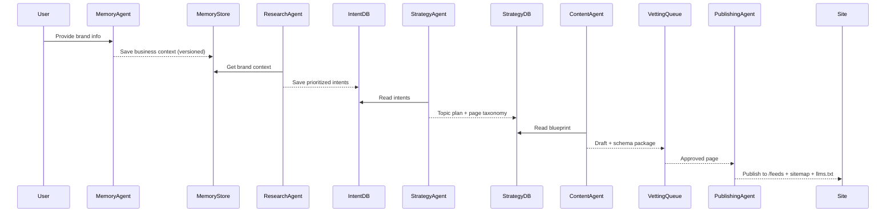
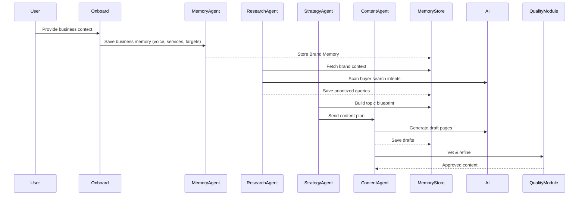
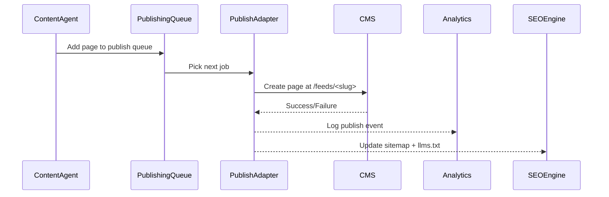
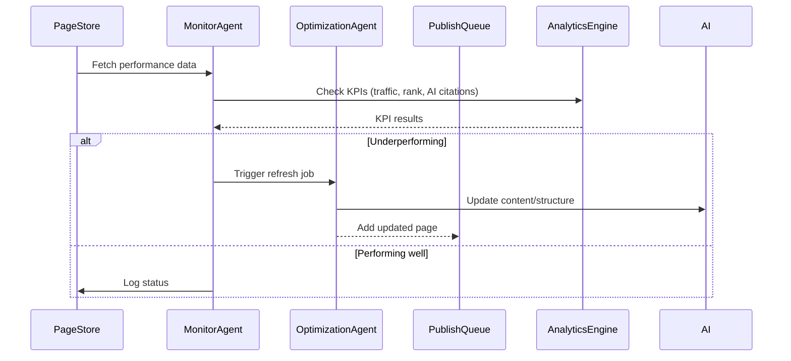
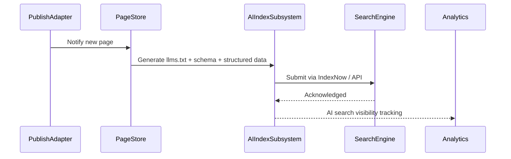
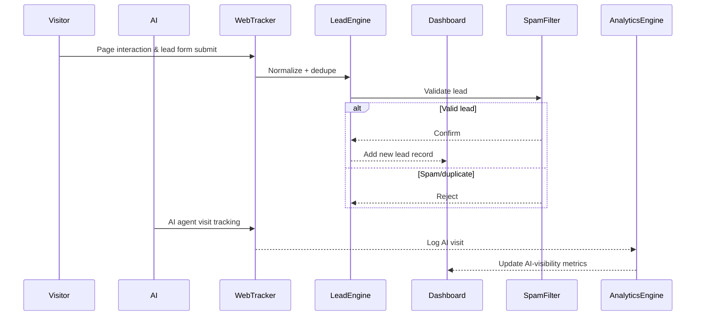

# GEOSEO / Gushwork-class — System & Functionality Flows

Text flow diagrams (inputs → processing → outputs → downstream) for every major
engine + the cross-cutting feedback loops. Pairs with `PRD-gushwork-platform.md`
(what) and `ROADMAP.md` (when). Convert to Mermaid/Figma as needed for handoff.

---

## 0. Overall autonomous pipeline (the continuous loop)
```
Onboarding → Brand Memory
  → Research (buyer intent) → Strategy (SERP/AI-answer gap) → Topic plan
  → Content Creation → Publishing (AI-first CMS)
  → Backlinks → Authority signals
  → Traffic + Leads → Lead Dashboard → Alerts
  → Analytics (SEO + AI search visibility)
  → Optimization / Content Refresh
  → Paid Boost (optional)
  → Insights → next cycle
```
Creation → authority → capture → performance → refresh is continuous and autonomous.

## 1. Brand Memory (single source of truth)
`Onboarding form + doc/website scrape → semantic extraction/entity parse → Brand Memory object → Memory DB (versioned) → injected as first context block into every agent prompt → updates on feedback`

## 2. Buyer Intent + Strategy
`Brand Memory → query discovery (Google autocomplete + AI-search patterns) → intent classification/filter → SERP & AI-answer scraping → gap scoring + opportunity ranking → topic clusters + page-type map → Strategy Blueprint (versioned)`

## 3. Content Creation & Publishing
`Blueprint → content prompts → LLM generation (BrandMemory + intent + SERP patterns) → draft → quality/brand vetting → HTML + metadata + schema package → Publishing Agent → live in /feeds resource hub → internal-link injection`

## 4. Backlinking / Authority
`Published pages → opportunity discovery (partners, industry networks) → prospect scoring (authority × relevance) → auto outreach template → send → track response → live link tracking → quality score update → signals to SEO/AI indexing`

## 5. Continuous Optimization / Refresh
`Published pages + analytics signals → rank/traffic monitoring → identify underperformers → trigger refresh (content / metadata / internal links) → re-optimize for intent shifts → push updated version live`

## 6. Lead Capture & Dashboard
`Published pages (forms + trackers) → visitor events + submissions → lead record → spam filter + dedupe → lead scoring (engagement + quality) → Lead Dashboard → actionable-lead alerts`

## 7. Analytics & AI Search Visibility
`Content + traffic data → event collection (impressions/clicks) → AI-engine citation trackers + SEO metrics → AI search visibility metrics (ChatGPT/Claude/Gemini/Perplexity) → dashboards + alerts → feeds optimization/refresh`

## 8. Paid Boost
`Config (budget/audience/messaging) → Paid Boost Agent generates ads → deploy to networks → traffic + lead metrics → optimize delivery → blend paid+organic → ROI report`

---

## Additional cross-cutting flows (feedback loops & ops)

### F1. AI-search citation & visibility feedback loop
`Published pages → AI-search crawl tracker → citation detection → AI-visibility signal DB → influences {content refresh, backlinking emphasis, topic reprioritization} → dashboard + alerts`

### F2. Content quality + human vetting
`AI draft → automated policy sanitizer → optional human review → Approve/Reject/Feedback → approved ⇒ Publishing; rejected ⇒ rework prompt & regenerate` (hallucination prevention, compliance, trust)

### F3. Competitor change detection
`Competitor SERP baseline → scheduled crawl (daily/weekly) → detect content changes / new ranking pages → gap-analysis update → trigger {new content, refresh, backlink ops} → Strategy Blueprint DB update`

### F4. Internal-linking & crawl-structure maintenance (self-healing graph)
`Page published/refreshed → semantic link extraction → link suggestions → automated application → site crawl-structure updated → improves crawl efficiency, ranking, AI-context discovery` (maintained over time, incl. on refresh/removal)

### F5. Live analytics event streaming
`User + AI-bot visits → streaming endpoint (Kafka-style) → real-time dashboard update → alerts (rank drop, lead spike) → feed optimization jobs` (near-real-time, not batch)

### F6. Backlink outreach & relationship management
`Prospect identified → outreach template → send (email/API) → track responses → positive ⇒ acquire link; no response ⇒ follow-up sequence → update backlink record` (fully staged autonomous op)

### F7. Multi-channel lead engagement
`Lead captured → qualification score → choose channel {email, SMS/WhatsApp, in-app} → engagement sequence → track open/click/reply → update status → CRM sync/handoff`

### F8. Scheduled report generation
`Scheduled job (recurrence per tier) → aggregate metrics → generate PDF/HTML → email + in-app delivery → archive in report history`

### F9. Paid campaign budget optimization & pacing
`Plan configured → budget allocation → deploy (Google/Meta) → collect spend+clicks+conversions → AI budget optimizer → adjust bids/targets → dashboard report` (data loop, not one-shot)

---

## Reference Mermaid (onboarding → first content)


---

## Sequence diagrams (Mermaid) — page creation, publishing, refresh, AI-feed, leads

### S1. AI-first content creation


### S2. Publishing to client CMS


### S3. Continuous refresh & optimization


### S4. AI feed / AI-search publication


### S5. Lead capture & analytics (human + AI-bot tracks)

